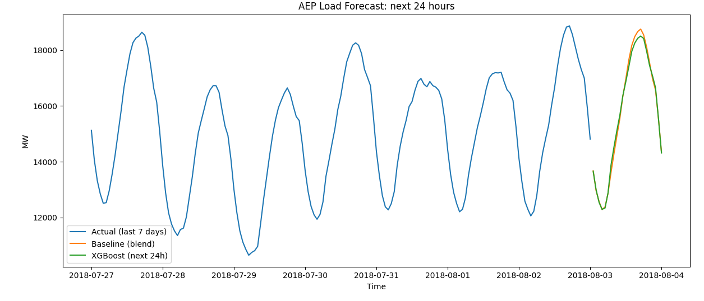
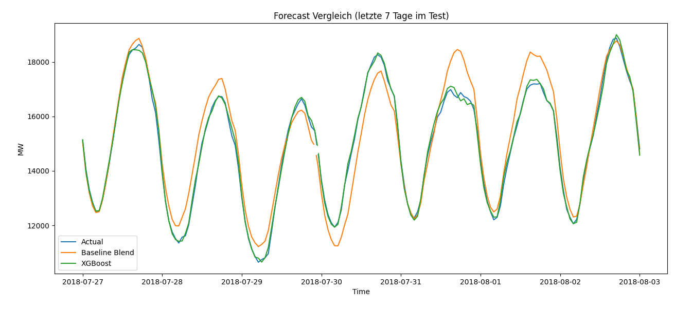
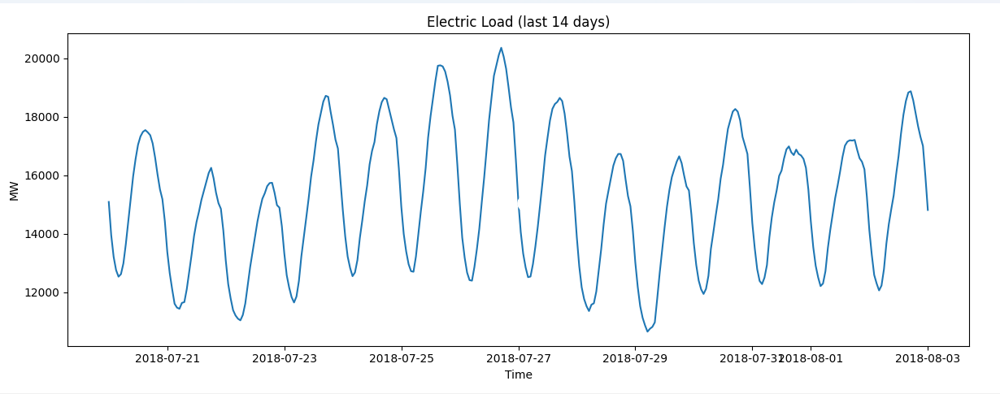
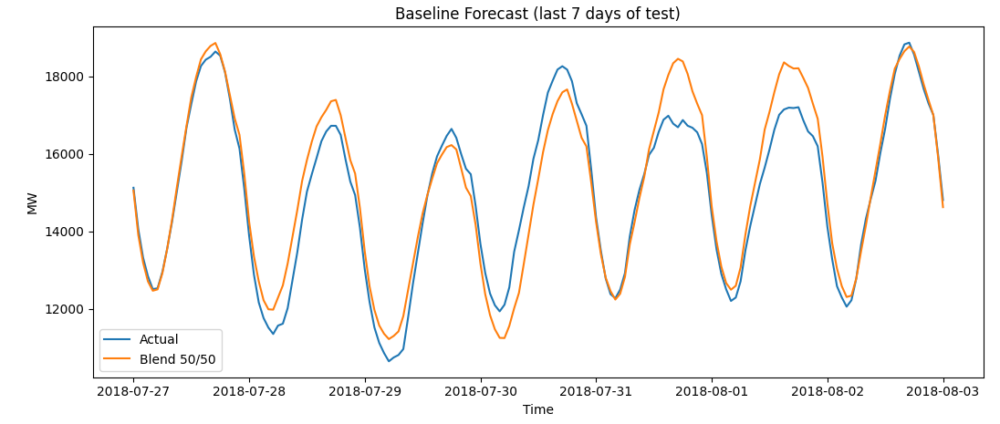

# ⚡ AEP Load Forecasting with XGBoost


Hourly electricity-load forecasting on the **AEP** grid region using calendar + lag features and **XGBoost**, benchmarked against strong naive baselines and exported as a next-24-hour forecast with an interactive Streamlit demo.



## Overview

A compact, end-to-end time-series pipeline:

1. **Feature engineering** — calendar features + autoregressive lags + rolling means (past-only, no leakage).
2. **Baselines** — "same hour yesterday", "same hour last week", and a 50/50 blend.
3. **Model** — gradient-boosted trees (XGBoost) with a time-based train/validation/test split.
4. **Forecast** — a recursive next-24-hour forecast exported to CSV + plot.
5. **Demo** — a Streamlit app to inspect the forecast interactively.

## Results

Evaluated on the **last 30 days** (hourly) as an out-of-time test set:

| Model | MAE (MW) | RMSE (MW) |
|---|---:|---:|
| Baseline (blend: yesterday + last week) | 921.10 | 1215.43 |
| **XGBoost** | **142.44** | **184.41** |

➡️ **~84.5 % lower MAE** than the baseline blend.



## Approach

- **Target:** hourly load `AEP_MW`.
- **Features** (`src/make_features.py`):
  - Calendar: `hour`, `dayofweek`, `month`, `is_weekend`
  - Lags: `lag_1` (1 h), `lag_24` (1 day), `lag_168` (1 week)
  - Rolling means (shifted, past-only): `roll_24_mean`, `roll_168_mean`
- **Split** (`src/xgb_eval.py`): time-based — train (up to −60 d), validation (−60 d … −30 d), test (last 30 d).
- **Model:** `XGBRegressor(n_estimators=800, learning_rate=0.05, max_depth=6, subsample=0.8, colsample_bytree=0.8)`.
- **24-hour forecast** (`src/forecast_24h.py`): the final model is fit on all data, then steps hour-by-hour, feeding each prediction back in as the next `lag_1`.

<details>
<summary>More plots</summary>

**Raw load (last 14 days)**


**Baseline forecast (last 7 days of the test window)**


</details>

## Project structure

```text
load-forecasting-xgboost/
├── src/
│   ├── plot_load.py        # EDA: plot the last 14 days of load
│   ├── make_features.py    # build calendar + lag + rolling features
│   ├── baseline_eval.py    # naive baselines (yesterday / last week / blend)
│   ├── xgb_eval.py         # train + evaluate XGBoost vs. baseline (last 30 days)
│   └── forecast_24h.py     # final model + recursive next-24h forecast export
├── streamlit_app.py        # interactive demo (reads assets/forecast_next24h.csv)
├── assets/                 # plots + a sample forecast CSV
├── requirements.txt
└── README.md
```

> `data/`, `reports/`, and `models/` are git-ignored and created at runtime.

## Dataset

This project uses the **AEP** hourly series from the public *Hourly Energy Consumption* dataset (PJM regions) on Kaggle:
<https://www.kaggle.com/datasets/robikscube/hourly-energy-consumption>

The data is **not** included in this repo. Download `AEP_hourly.csv` (columns `Datetime`, `AEP_MW`) and place it at `data/AEP_hourly.csv`.

## Setup

```powershell
python -m venv .venv
.\.venv\Scripts\Activate.ps1
python -m pip install --upgrade pip
pip install -r requirements.txt
```

The requirements include the Streamlit demo as well as the training and
evaluation dependencies.

## Usage (Windows / PowerShell)

Run from the repository root:

```powershell
# 1) create local artifact folders (git-ignored) and add the dataset
mkdir data, reports\figures, models
#    -> place AEP_hourly.csv in .\data\

# 2) build the validated feature table
python -m src.make_features

# 3) evaluate baselines and XGBoost (test = last 30 days)
python src\baseline_eval.py
python src\xgb_eval.py

# 4) train the final model and export the next-24h forecast
python src\forecast_24h.py
```

## Demo (Streamlit)

```powershell
streamlit run streamlit_app.py
```

The app loads the bundled `assets/forecast_next24h.csv` by default, or lets you upload your own forecast CSV.

## Data validation

The feature command validates the required columns, parses timestamps and load
values strictly, averages duplicate timestamps, and rejects missing hours before
building row-based lags. This prevents an unnoticed time gap from turning
`lag_24` into something other than the same hour on the previous day.

Custom paths and target columns can be supplied without editing the source:

```powershell
python -m src.make_features `
  --input data\AEP_hourly.csv `
  --output data\features_aep.csv `
  --target AEP_MW
```

Run the synthetic validation tests with:

```powershell
pip install -r requirements-dev.txt
python -m pytest
```

## Limitations

- Single region (AEP) and a **point** forecast — no uncertainty intervals.
- The 24-hour forecast is **recursive**, so errors can compound over the horizon.
- Features are calendar + lags only — no weather or holiday signals.
- Reported metrics come from a single 30-day out-of-time test window.

## License

Released under the **MIT License** — see [LICENSE](LICENSE). © 2026 Amar Akram.
